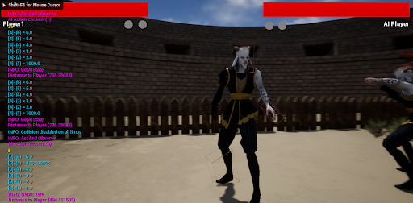
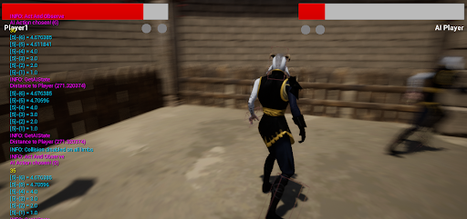
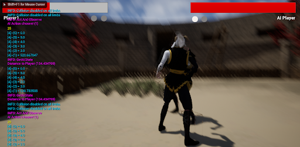
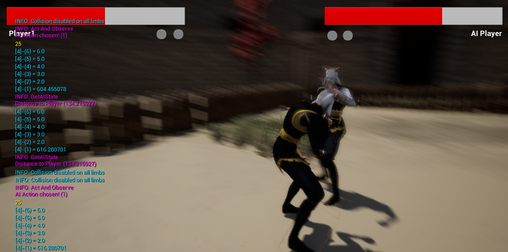

# Ai Combat

## Game Overview

### Background

Our team has created an engaging 3D third-person fighter game designed for competitive play. This game pits players against each other in intense, strategic battles to determine the ultimate champion. The game features:

- **Objective**: Deplete your opponent’s health to zero in a best-of-three format. The first to win two rounds is declared the winner.
- **Health Mechanics**: Each round starts with 100 HP for both players.
- **Combat Moves**:
  - **Punch**: Inflicts 5 damage.
  - **Headbutt**: Inflicts 10 damage.
  - **Kick**: Inflicts 12 damage.
- **Defense Mechanic**: Players can block incoming attacks.

### Gameplay

Players use the following controls:

- **Movement**: WASD keys.
- **Punch**: U key.
- **Kick**: O key.
- **Headbutt**: I key.
- **Game Reset**: R key.

The game resets automatically after a player or AI loses two rounds, allowing for seamless replayability. Currently, the game includes one visually captivating and well-designed map, with plans to introduce more in future updates.

---

## Technical Details

### AI Technique: Q-Learning

We implemented a **Reinforcement Learning (RL)** approach, specifically **Q-Learning**, to create an adaptive AI opponent. This ensures that players face challenging, intelligent, and evolving gameplay.

#### Why Q-Learning?

- Unlike behavior trees, which can feel predictable or artificial, Q-Learning enables the AI to make informed decisions while maintaining a human-like play style.
- Q-Learning is a **model-free, value-based algorithm** that assigns Q-values to state-action pairs. These Q-values represent the expected reward for taking an action in a given state, guiding the AI to make optimal decisions.

### Implementation Details

#### State Space

The state space (S) was defined using combinations of:

- **Player's HP status**: Low/High.
- **AI's HP status**: Low/High.
- **Proximity**: Fighters are close (≤ 350 units) or distant.

This results in 8 states:

```
(Player HP Low, AI HP Low, Close)
(Player HP Low, AI HP Low, Distant)
(Player HP Low, AI HP High, Close)
(Player HP Low, AI HP High, Distant)
(Player HP High, AI HP Low, Close)
(Player HP High, AI HP Low, Distant)
(Player HP High, AI HP High, Close)
(Player HP High, AI HP High, Distant)
```

#### Action Set

The action set (A) includes:

- Punch
- Headbutt
- Kick
- Block
- Approach
- Retreat

#### Q-Learning Update Rule

The Q-values are updated using:

```
Q(s,a) <- Q(s,a) + α(r + γ maxQ(s', a') - Q(s,a))
```

Where:

- **Q(s,a)**: Current Q-value of the state-action pair.
- **r**: Reward received.
- **maxQ(s', a')**: Maximum Q-value for the next state.
- **γ**: Discount factor (set to 0.8).
- **α**: Learning rate (set to 0.8).

#### Reward Function

Rewards are calculated based on HP changes:

1. **Positive Reward**: AI inflicts more damage than it receives.
2. **Negative Reward**: AI receives more damage than it inflicts.

#### Training

The AI learns on-site, adapting dynamically to player inputs and behaviors.

---

## Test Cases

### Test Case 1: If the AI’s health is low then we should expect it to retreat.

#### Scenario

- **Initial Observation**:
  - 
  - This figure was taken at the beginning of the game. On the left, we can see the values being logged:
    - **State Values [4]**: Represent Q-values for actions in State 4 (Player near AI). The values are:
      - **(6)**: Retreat with a Q-value of 6.
      - **(5)**: Approach with a Q-value of 5.
      - **(4)**: Block with a Q-value of 4.
      - **(3)**: Kick with a Q-value of 3.
      - **(2)**: Headbutt with a Q-value of 2.
      - **(1)**: Punch with a significantly higher Q-value of 1000, favoring this action in the current state.
    - **Distance to Player (288.35083)**: Indicates proximity between the AI and Player.
    - **AI Action Chosen (1)**: Confirms the AI selected Punch based on the highest Q-value.

- **Outcome**:
  - 
  - After reducing the AI player's HP, we transition to State 5. The logged Q-values now indicate a much higher value for Action 6 (Retreat), implying that the AI is correctly choosing to retreat when its health is low.

### Test Case 2: The AI should try to attack the player as much as it can if its health is not low.

#### Scenario

- **Observation**:
  - 
  - We can see that when the Player is near the AI (State 4), it favors attacking represented by the high Q (> 500) value in Action 1.

### Test Case 3: If the AI is attacked and its health is not low it should attack the player if they are near.

#### Scenario

- **Observation**:
  - 
  - Above we can see that the AI has taken some damage and that the Player is near the AI (represented by State 4). It favors punching the Player (Action 1), as indicated by the Q-values.
- **Outcome**:
  - 
  - Based on all these cases it's evident that the AI is behaving as expected.

---

## Discussion of Limitations

Our AI game agent does have certain limitations that can impact its performance and decision-making capabilities. The primary limitation stems from the restricted state representation it uses to understand the game environment. For example, while it can discern between "close" and "not close" to an opponent, it struggles to comprehend other spatial nuances, such as varying degrees of distance or specific positions on the game map. This could lead to suboptimal actions and strategies in certain scenarios.

Additionally, the AI's understanding of rewards is limited, which can cause confusion when facing unexpected outcomes. For example, the AI might correctly execute a punch when near an opponent, but if the opponent counters the attack, the AI may struggle to interpret this development. This again is a limitation of the number of states that are available to the agent. This limitation in understanding the state of the game could leave the AI vulnerable to exploitation by experienced players who can predict...

In summary, the limitations of our AI in the game include:

- A simplified state representation that only distinguishes between "close" and "not close," leading to potential misunderstandings of the game environment.
- A limited understanding of rewards can cause confusion when faced with unexpected outcomes or situations.
- Experienced players may be able to "break" the AI by exploiting these limitations, using strategies that take advantage of the AI's inability to fully comprehend the game's state and adapt to changing circumstances.


---

## References

The following assets were used in the game development process:

1. **Fighter Character Model**: [Mixamo - Brady](https://www.mixamo.com/#/?page=1&query=brady&type=Character)
2. **Headbutt Animation Model**: [Mixamo - Headbutt](https://www.mixamo.com/#/?page=1&query=Headbutt&type=Motion%2CMotionPack)
3. **Punch Animation Model**: [Mixamo - Punch](https://www.mixamo.com/#/?page=1&query=Punch&type=Motion%2CMotionPack)
4. **Kick Animation Model**: [Mixamo - Kick](https://www.mixamo.com/#/?page=1&query=Kick&type=Motion%2CMotionPack)
5. **Map Assets**: [Unreal Engine Marketplace - Gladiator Arena](https://www.unrealengine.com/marketplace/en-US/product/gladiator-arena?sessionInvalidated=true)
